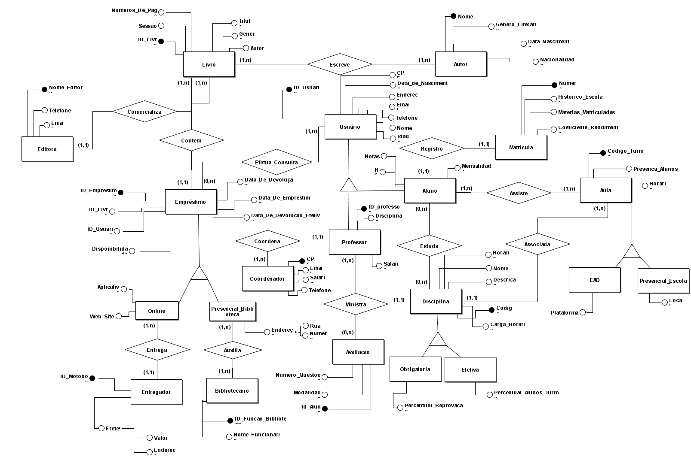

# EducaLivros Online

## Grupo

|                       |                        |
|:---------------------:|:----------------------:|
| Eduarda Barros        |     Gustavo Lima       |
|    *RA: 00000844550*  |   *RA: 00000844518*    |
|                       |                        |
|   Marcelo Petroni     |      Matheus Silva     |
|    *RA: 00000032651*  |    *RA: 00000007395*   |


## Descrição do Sistema
O banco de dados apresentado é uma estrutura complexa que abrange várias entidades e seus relacionamentos. Ele representa uma escola-livraria, fornecendo suporte para gerenciamento de livros, autores, usuários, empréstimos, entre outros. As tabelas incluem informações detalhadas, como gênero e título do livro, dados dos autores, informações de usuários, registros de empréstimos, além de aspectos relacionados à gestão escolar, como disciplinas, aulas e desempenho dos alunos. Os relacionamentos são estabelecidos por chaves estrangeiras, garantindo integridade referencial entre as tabelas e permitindo operações de consulta e manipulação eficazes.

Este banco de dados oferece um arcabouço abrangente para o gerenciamento eficiente de uma biblioteca e atividades educacionais, desde o cadastro de materiais até o controle de empréstimos e avaliações acadêmicas. Os dados são estruturados de forma a refletir as interações entre os diversos componentes do sistema, facilitando a busca e recuperação de informações relevantes. As restrições de chave estrangeira garantem a consistência dos dados e ajudam a manter a integridade do banco de dados, enquanto as operações de exclusão são cuidadosamente configuradas para preservar a coesão do sistema.

## Modelo Lógico


## Modelo Conceitual



## Requisitos Implementados

- **Entidades Principais E Seus Atributos**: 
  - *Editora*: Nome_Editora, Telefone, Email
  - *Livro*: ID_Livro, Sessao, Numero_De_Pags, Titulo, Genero, Autor
  - *Emprestimo*: ID_Emprestimo, ID_Livro, ID_Usuario, Disponibilidade, Data_de_devolucao, Data_de_emprestimo, Data_de_devolucao_efetiva
  - *Online*: Aplicativo, Web_site
  - *Presencial_Biblioteca*: Endereço
  - *Entregador*: ID_Motoboy, Frete
  - *Balcao_Biblioteca*: ID_Funcao_Biblioteca, Nome_Funcionario
  - *Usuario*: ID_Usuario, CPF, Data_de_nascimento, Endereço, Email, Telefone, Nome, Idade
  - *Aluno*: RG, Notas, Mensalidade
  - *Professor*: Ident, Diciplinas, Salario
  - *Avaliacao*: Numero_questao, Modalidade, ID_Aluno
  - *Coordenador*: CPF, Email, Salario, Telefone
  - *Autor*: Nome, Genero_Literario, Data_de_nascimento, Nacionalidade
  - *Matricula*: Numero, Historico_escolar, Materias_matriculadas, Coeficiente_rendimento
  - *Disciplina*: Horario, Nome, Descricao, Carga_horaria, Codigo
  - *Obrigatoria*: Percentual_reprovacao, 
  - *Eletiva*: Percentual_alunos_turma
  - *Aula*: Codigo_turma, Presenca_aluno, Horario
  - *EAD*: Plataforma
  - *Presencial_Escola*: Local


# Projeto 2: Criação do Banco de dados

## Data Manipulation Language (DML)

### Criar Tabelas

Para criar as tabelas do nosso banco de dados, consulte o arquivo CodigoSql.sql presente neste repositório. Esse arquivo contém todas as instruções SQL necessárias para a criação das tabelas.

### INSERT

Também disponibilizamos um arquivo insert-update-delete.txt que contém diversas inserções, atualizações e exclusões. Utilize este arquivo para realizar testes adicionais conforme necessário.

*Aqui abaixo temos alguns exemplos:*

```sql
INSERT INTO Editora (Nome_Editora, Telefone, Email) 
VALUES 
('Companhia das Letras', '+55 11 9999-9999', 'contato@companhiadasletras.com.br'),
('Penguin Random House', '+1 212-782-9000', 'info@penguinrandomhouse.com'),
('HarperCollins', '+1 212-207-7000', 'webmaster@harpercollins.com');

INSERT INTO Usuario (ID_Usuario, Telefone, Email, Endereco, Data_de_Nascimento, CPF, Nome, Idade) 
VALUES 
(1, '+55 11 1234-5678', 'fulano@gmail.com', 'Rua A, 123', '1990-01-15', '123.456.789-00', 'Fulano de Tal', 34),
(2, '+55 11 9876-5432', 'beltrano@gmail.com', 'Rua B, 456', '1985-05-20', '987.654.321-00', 'Beltrano da Silva', 39),
(3, '+55 11 1111-2222', 'ciclano@gmail.com', 'Rua C, 789', '2000-12-10', '111.222.333-00', 'Ciclano Pereira', 24);

INSERT INTO Livro (Titulo, ID_Livro, Sessao, Numeros_De_Pags, Autor, Ano, Genero, Numero, fk_Emprestimo_ID_Emprestimo, fk_Editora_Nome_Editora) 
VALUES 
('Dom Casmurro', 1, 'Ficção', 256, 'Machado de Assis', 1899, 'Romance', 101, NULL, 'Companhia das Letras'),
('Os Miseráveis', 2, 'Ficção', 1488, 'Victor Hugo', 1862, 'Romance', 102, NULL, 'Penguin Random House'),
('1984', 3, 'Ficção', 328, 'George Orwell', 1949, 'Ficção Científica', 103, NULL, 'HarperCollins');

INSERT INTO Emprestimo (ID_Emprestimo, ID_Livro, ID_Usuario, Data_De_Emprestimo, Data_De_Devolucao_Efetiva, Data_De_Devolucao, Disponibilidade) 
VALUES 
(101, 1, 1, '2024-04-20', '2024-05-10', NULL, 'Disponível'),
(102, 2, 2, '2024-04-15', NULL, NULL, 'Indisponível'),
(103, 3, 3, '2024-04-10', NULL, NULL, 'Indisponível');
```

### DELETE

```sql
DELETE FROM Usuario WHERE ID_Usuario = 3;

DELETE FROM Livro WHERE ID_Livro = 2;

DELETE FROM Bibliotecario WHERE ID_Funcao_Biblioteca = 1;

DELETE FROM Bibliotecario WHERE Nome_Funcionario = 'João Silva';
```

### UPDATE

```sql
UPDATE Editora SET Telefone = '+55 11 9876-5432' WHERE Nome_Editora = 'Companhia das Letras';

UPDATE Editora SET Email = 'info@harpercollins.com' WHERE Nome_Editora = 'HarperCollins';

UPDATE Usuario SET Telefone = '+55 11 1111-2222', Email = 'novobeltrano@gmail.com' WHERE ID_Usuario = 2;

UPDATE Emprestimo SET Data_De_Emprestimo = '2024-04-24' WHERE ID_Livro = 2;

UPDATE Emprestimo SET Data_De_Devolucao = '2024-05-24' WHERE ID_Livro = 2;

UPDATE Emprestimo SET Data_De_Devolucao_Efetiva = '2024-06-24' WHERE ID_Livro = 2;
```


## Tomada de Decisão

Antes de prosseguir com as consultas, insira os dados no banco de dados. Utilize o arquivo txt (`insert-update-delete.txt`) fornecido para realizar os testes.

### 1. Qual é o gênero mais alugado entre os alunos da escola?

Para identificar o gênero mais alugado entre os alunos da escola, execute o seguinte código SQL:

```sql
SELECT Livro.Genero, COUNT() AS Quantidade_Alugada
FROM Emprestimo
JOIN Livro ON Emprestimo.ID_Livro = Livro.ID_Livro
GROUP BY Livro.Genero
ORDER BY Quantidade_Alugada DESC
LIMIT 1
```

### 2. Qual a quantidade de devoluções de livros dentro do prazo de vencimento?

Para verificar a quantidade de devoluções de livros dentro do prazo de vencimento, utilize o seguinte código SQL:

```sql
SELECT COUNT() AS Devolucoes_Dentro_Do_Prazo
FROM Emprestimo
WHERE Data_De_Devolucao_Efetiva <= Data_De_Devolucao; -- Considerando que a data de devolução efetiva é menor ou igual à data de devolução esperada
```

### 3. Qual é o média percentual de reprovações em disciplinas obrigatorias?

Para calcular a média percentual de reprovação para os alunos que estudam disciplinas obrigatórias, utilize o seguinte código SQL:

```sql
SELECT AVG(percentual_reprovacao)
FROM obrigatoria;
```

### 4. Como está a disponibilidade dos livros nos diferentes canais de distribuição (presencial e online)?

Para avaliar a disponibilidade dos livros nos diferentes canais de distribuição (presencial e online), execute o seguinte código SQL:

```sql
SELECT
    Livro.Titulo AS Titulo_Livro,
    COUNT(Presencial_Biblioteca.fk_Emprestimo_ID_Emprestimo) AS Quantidade_Presencial,
    COUNT(Online.fk_Emprestimo_ID_Emprestimo) AS Quantidade_Online
FROM
    Livro
LEFT JOIN
    Presencial_Biblioteca ON Livro.ID_Livro = Presencial_Biblioteca.fk_Emprestimo_ID_Emprestimo
LEFT JOIN
    Online ON Livro.ID_Livro = Online.fk_Emprestimo_ID_Emprestimo
GROUP BY
    Livro.Titulo;
```

### 5. Qual o percentual de presença dos alunos nas aulas?

Para calcular o percentual de presença dos alunos nas aulas, utilize o seguinte código SQL:

```sql
SELECT 
    Aula.Codigo_Turma AS Codigo_Turma,
    COUNT(CASE WHEN Aula.Presenca_Alunos = 'Presente' THEN 1 END) AS Alunos_Presentes,
    COUNT(CASE WHEN Aula.Presenca_Alunos = 'Ausente' THEN 1 END) AS Alunos_Ausentes,
    COUNT() AS Total_Alunos,
    (COUNT(CASE WHEN Aula.Presenca_Alunos = 'Presente' THEN 1 END) 100.0 / COUNT(*)) AS Percentual_Presenca
FROM 
    Aula
GROUP BY 
    Aula.Codigo_Turma;
```

## 1 - Easter Egg

*Easter Egg:* Aluno com o maior coeficiente de rendimento ganha 100% de desconto na matrícula.

Para ativar o Easter Egg e conceder o desconto ao aluno com o maior coeficiente de rendimento, siga estes passos:

1. Identifique o aluno com o maior coeficiente de rendimento:

```sql
SELECT * FROM Aluno_Matricula WHERE Coeficiente_Rendimento = (SELECT MAX(Coeficiente_Rendimento) FROM Aluno_Matricula);
```

2. Atualize os dados do aluno com o maior coeficiente de rendimento:

```sql
SELECT Desconto_Matricula();
```

3. Verifique se a mensalidade foi atualizada para 0:

```sql
SELECT * FROM Aluno_Matricula;
```
# Projeto 3: Pitch

## Roteiro do pitch

### Nosso roteiro de venda apresenta os principais pontos para promover o Banco Educalivros como uma solução abrangente e inovadora para a gestão educacional e bibliotecária. Destacamos os seguintes pontos:

*- Descrição do Projeto:*  EducaLivros é uma plataforma que integra uma escola com uma livraria, oferecendo uma abordagem única para o aprendizado e a promoção da leitura.

*- A Essência da EducaLivros:* Nosso banco de dados combina o ambiente acadêmico de uma escola com a riqueza cultural de uma livraria, proporcionando uma experiência educacional única e enriquecedora. Uma escola bem gerenciada, além de promover uma melhor eficiência, transparência e qualidade na gestão educacional, pode ser enriquecida pela presença de uma livraria bem gerenciada, estimulando o aprendizado e enriquecendo o ambiente educacional.

*- Principais Características:* 
Oferecemos uma ampla coleção literária que abrange desde livros didáticos até obras literárias clássicas e materiais de referência. Nosso sistema de gerenciamento de livros permite catalogar e administrar com facilidade uma variedade diversificada de obras, fornecendo informações detalhadas sobre título, autor, editora, gênero e número de páginas. Além disso, nosso ambiente educacional é enriquecido com espaços dedicados à leitura, pesquisa e interação com os materiais disponíveis, proporcionando uma experiência de aprendizado envolvente e estimulante.

*Por que usar Educa-Livros? :* Pode ser feito um acompanhamento do progresso estudantil, estimulando decisões estratégicas na gestão, com atendimento personalizado, que soluciona as necessidades dos alunos e melhora rentabilidade do seu negócio.


## 2 - Easter Egg

*Easter Egg:* Recomendações Personalizadas com base no histórico de leitura dos usuários.

Para ativar o Easter Egg, siga estes passos:

1. "Recomendações Personalizadas":

```sql
SELECT DISTINCT l.id_livro, l.genero
FROM emprestimo e
JOIN livro l ON e.id_livro = l.id_livro
WHERE e.id_usuario = (/* Inserir id_usuario desejado */);
```


# Projeto 4: Grand Finale

### No Projeto 4, implementaremos novas funcionalidades e aprimoraremos a eficiência do banco de dados, utilizando operações CRUD, normalização, triggers, stored procedures, views e controles de acesso.

## Triggers

Obs: *Para saber detalhadamente como usar os Triggers, consulte o arquivo `trigger.md` presente neste repositório. Temos um passo a passo para cada Trigger* apresentado abaixo.

### Trigger 1: Guardando Alterações

Este trigger tem o objetivo de registrar todas as alterações (inserções, atualizações e deleções) realizadas na tabela `Usuario` em uma tabela de auditoria chamada `Usuario_Audit`. Isso permite manter um histórico das operações realizadas, facilitando o rastreamento das mudanças feitas nos registros dos usuários.

1. **Criação da Função**:
```sql
CREATE OR REPLACE FUNCTION log_usuario_changes()
RETURNS TRIGGER AS $$
BEGIN
    IF TG_OP = 'INSERT' THEN
        INSERT INTO Usuario_Audit (operation, usuario_id, usuario_nome, change_time)
        VALUES ('INSERT', NEW.ID_Usuario, NEW.Nome, NOW());
    ELSIF TG_OP = 'UPDATE' THEN
        INSERT INTO Usuario_Audit (operation, usuario_id, usuario_nome, change_time)
        VALUES ('UPDATE', NEW.ID_Usuario, NEW.Nome, NOW());
    ELSIF TG_OP = 'DELETE' THEN
        INSERT INTO Usuario_Audit (operation, usuario_id, usuario_nome, change_time)
        VALUES ('DELETE', OLD.ID_Usuario, OLD.Nome, NOW());
    END IF;
    RETURN NULL;
END;
$$ LANGUAGE plpgsql;
```
2. **Criar nosso Trigger:**
```sql
CREATE TRIGGER usuario_changes_trigger
AFTER INSERT OR UPDATE OR DELETE ON Usuario
FOR EACH ROW EXECUTE FUNCTION log_usuario_changes();
```
### Trigger 2: Guardando Alterações

Este trigger tem o mesmo objetivo de registrar todas as alterações (inserções, atualizações e deleções), mas agora na tabela emprestimo. 

1. **Criação da Função**:
```sql
CREATE OR REPLACE FUNCTION log_emprestimo_changes()
RETURNS TRIGGER AS $$
BEGIN
    IF TG_OP = 'INSERT' THEN
        INSERT INTO Emprestimo_Audit (operation, emprestimo_id, livro_id, usuario_id, data_emprestimo, data_devolucao, data_devolucao_efetiva, disponibilidade, change_time)
        VALUES ('INSERT', NEW.ID_Emprestimo, NEW.ID_Livro, NEW.ID_Usuario, NEW.Data_De_Emprestimo, NEW.Data_De_Devolucao, NEW.Data_De_Devolucao_Efetiva, NEW.Disponibilidade, NOW());
    ELSIF TG_OP = 'UPDATE' THEN
        INSERT INTO Emprestimo_Audit (operation, emprestimo_id, livro_id, usuario_id, data_emprestimo, data_devolucao, data_devolucao_efetiva, disponibilidade, change_time)
        VALUES ('UPDATE', NEW.ID_Emprestimo, NEW.ID_Livro, NEW.ID_Usuario, NEW.Data_De_Emprestimo, NEW.Data_De_Devolucao, NEW.Data_De_Devolucao_Efetiva, NEW.Disponibilidade, NOW());
    ELSIF TG_OP = 'DELETE' THEN
        INSERT INTO Emprestimo_Audit (operation, emprestimo_id, livro_id, usuario_id, data_emprestimo, data_devolucao, data_devolucao_efetiva, disponibilidade, change_time)
        VALUES ('DELETE', OLD.ID_Emprestimo, OLD.ID_Livro, OLD.ID_Usuario, OLD.Data_De_Emprestimo, OLD.Data_De_Devolucao, OLD.Data_De_Devolucao_Efetiva, OLD.Disponibilidade, NOW());
    END IF;
    RETURN NULL;
END;
$$ LANGUAGE plpgsql;
```


2. **Criar nosso Trigger:**
```sql
CREATE TRIGGER emprestimo_changes_trigger
AFTER INSERT OR UPDATE OR DELETE ON Emprestimo
FOR EACH ROW EXECUTE FUNCTION log_emprestimo_changes();
```

### Trigger 3: Validação de Dados

A ideia desse trigger é garantir que o campo Telefone inserido na tabela Usuario sempre siga um formato específico, por exemplo: "(XX) XXXX-XXXX", antes de permitir a inserção ou atualização. Se o telefone não estiver no formato correto, uma exceção será lançada e a operação será impedida.

1. **Criar a função que o trigger vai chamar**:

```sql
CREATE OR REPLACE FUNCTION validate_phone_format()
RETURNS TRIGGER AS $$
BEGIN
    -- Verificar se o telefone inserido atende ao formato esperado
    IF NEW.Telefone !~ '^\(\d{2}\) \d{4}-\d{4}$' THEN
        -- Se não atender, lançar um erro e impedir a inserção
        RAISE EXCEPTION 'O telefone deve seguir o formato (XX) XXXX-XXXX';
    END IF;
    
    -- Se o telefone estiver no formato correto, permitir a inserção
    RETURN NEW;
END;
$$ LANGUAGE plpgsql;
```

2. **Criar o trigger que chama a função antes de inserir na tabela Usuario**:
```sql
CREATE TRIGGER validate_phone_trigger
BEFORE INSERT OR UPDATE ON Usuario
FOR EACH ROW EXECUTE FUNCTION validate_phone_format();
```
### Stored Procedures

#### Stored Procedure 1: Total de Empréstimos de um Livro

Esta stored procedure calcula o total de empréstimos de um determinado livro, identificado pelo seu ID.

```sql
CREATE OR REPLACE FUNCTION Total_Emprestimos_Livro(livro_id INT) RETURNS INT AS $$
DECLARE
    total_emprestimos INT;
BEGIN
    SELECT COUNT(*) INTO total_emprestimos
    FROM Emprestimo
    WHERE ID_Livro = livro_id;

    RETURN total_emprestimos;
END; $$
LANGUAGE plpgsql;
```

**Como usar:**

Para obter o total de empréstimos de um livro com ID 1, execute:

```sql
SELECT Total_Emprestimos_Livro(1);
```

---

#### Stored Procedure 2: Atualizar Disponibilidade de um Livro

Esta stored procedure atualiza a disponibilidade de um livro com base na data de devolução. Se a data de devolução efetiva for nula (o livro ainda não foi devolvido), ele será marcado como "Indisponível". Caso contrário, será marcado como "Disponível".

```sql
CREATE OR REPLACE PROCEDURE Atualizar_Disponibilidade_Livro()
LANGUAGE plpgsql
AS $$
BEGIN
    UPDATE Emprestimo
    SET Disponibilidade = CASE
        WHEN Data_De_Devolucao_Efetiva IS NULL THEN 'Indisponível'
        ELSE 'Disponível'
    END;
END; $$
```

**Como usar:**

Para atualizar a disponibilidade de todos os livros, execute:

```sql
CALL Atualizar_Disponibilidade_Livro();
```

---

#### Stored Procedure 3: Atualizar o Saldo de Mensalidades

Esta stored procedure atualiza o saldo de mensalidades dos alunos com base no coeficiente de rendimento.

```sql
CREATE OR REPLACE PROCEDURE Atualizar_Saldo_Mensalidades()
LANGUAGE plpgsql
AS $$
BEGIN
    UPDATE Aluno_Matricula
    SET Mensalidade = Mensalidade * 0.9
    WHERE Coeficiente_Rendimento >= 8.0;

    UPDATE Aluno_Matricula
    SET Mensalidade = Mensalidade * 1.1
    WHERE Coeficiente_Rendimento < 8.0;
END; $$
```

**Como usar:**

Para atualizar o saldo de mensalidades de todos os alunos, execute:

```sql
CALL Atualizar_Saldo_Mensalidades();
```

### Views
#### View 1: Atraso de livros

Essa view serve para visualizar os alunos que atrasaram a devolução de livros.

```sql
CREATE VIEW DataEmprestimo as 
SELECT id_emprestimo,
	   id_livro,
	   id_usuario,
	   disponibilidade
FROM emprestimo
WHERE data_de_devolucao < data_de_devolucao_efetiva
```

**Como usar:**

Para chamar a view, utilize:

```sql
SELECT * FROM DataEmprestimo;
```

#### View 2: Melhores notas

Essa view serve para visualizar informações dos alunos com as melhores notas (8.5 pra cima)

```sql
CREATE VIEW AlunosMelhoresNotas AS 
SELECT u.id_usuario,
       u.nome,
       u.telefone,
       u.email,
       u.endereco,
       u.data_de_nascimento,
       u.cpf,
       u.idade,
       am.coeficiente_rendimento,
       am.notas,
       am.materias_matriculadas,
       am.historico_escolar
FROM usuario u 
INNER JOIN aluno_matricula am ON u.id_usuario = am.fk_usuario_id_usuario
WHERE am.coeficiente_rendimento >= 8.5;
```

**Como usar:**

Para chamar a view, utilize:

```sql
SELECT * FROM AlunosMelhoresNotas;
```
---
### Segurança

Foram definidos três níveis de controle de acesso para conceder permissões específicas na manipulação de dados do esquema. Os cargos servem como um filtro para que um usuário possa acessar, deletar, atualizar ou apagar dados selecionados, conforme as permissões atribuídas. Os cargos definidos são: Professor, Coordenador e Diretor.
<br/>
#### 1. Aqui foi criado os cargos:
```sql
CREATE ROLE professor;
CREATE ROLE coordenador;
CREATE ROLE diretor;
```
#### 2. Aqui foi criado os usuários:
```sql
CREATE USER professor_lucas WITH PASSWORD '123';
GRANT professor TO professor_lucas;


CREATE USER coordenador_fulano WITH PASSWORD '123';
GRANT coordenador TO coordenador_fulano;


CREATE USER diretor_fulano WITH PASSWORD '123';
GRANT diretor TO diretor_fulano;
```
#### 3. Aqui foi definido suas respectivas permissões, as tabelas que cada cargo tem acesso e que operação é permitida realizar com esses dados:
Professor:
```sql
GRANT SELECT ON disciplina TO professor;
GRANT SELECT, UPDATE ON avaliacao TO professor;
GRANT SELECT ON aula TO professor;
GRANT SELECT ON obrigatoria TO professor;
GRANT SELECT, UPDATE ON eletiva TO professor;
GRANT SELECT, INSERT ON aluno_matricula TO professor;
```
Coordernador:
```sql
GRANT SELECT, INSERT, UPDATE, DELETE ON professor TO coordenador;
GRANT SELECT, INSERT, UPDATE ON aluno_matricula TO coordenador;
GRANT SELECT, INSERT, UPDATE ON aula TO coordenador;
GRANT SELECT, INSERT, UPDATE, DELETE ON eletiva TO coordenador;
GRANT SELECT ON obrigatoria TO coordenador;
```
Diretor:
```sql
GRANT ALL PRIVILEGES ON usuario TO diretor;
GRANT ALL PRIVILEGES ON aluno_matricula TO diretor;
GRANT ALL PRIVILEGES ON coordenador TO diretor;
GRANT ALL PRIVILEGES ON professor TO diretor;
GRANT ALL PRIVILEGES ON bibliotecario TO diretor;
GRANT ALL PRIVILEGES ON entregador TO diretor;
GRANT ALL PRIVILEGES ON emprestimo TO diretor;
```

#### Se um usuário tentar realizar uma operação ou acessar uma tabela sem permissão:


#### Usuários que escreverem a senha ou nome de usuário incorretamente não irão ter acesso as permissões:

Com essas medidas, torna o banco de dados mais direcionado e protegido de situações adversas em relação aos dados do ambiente escolar.


