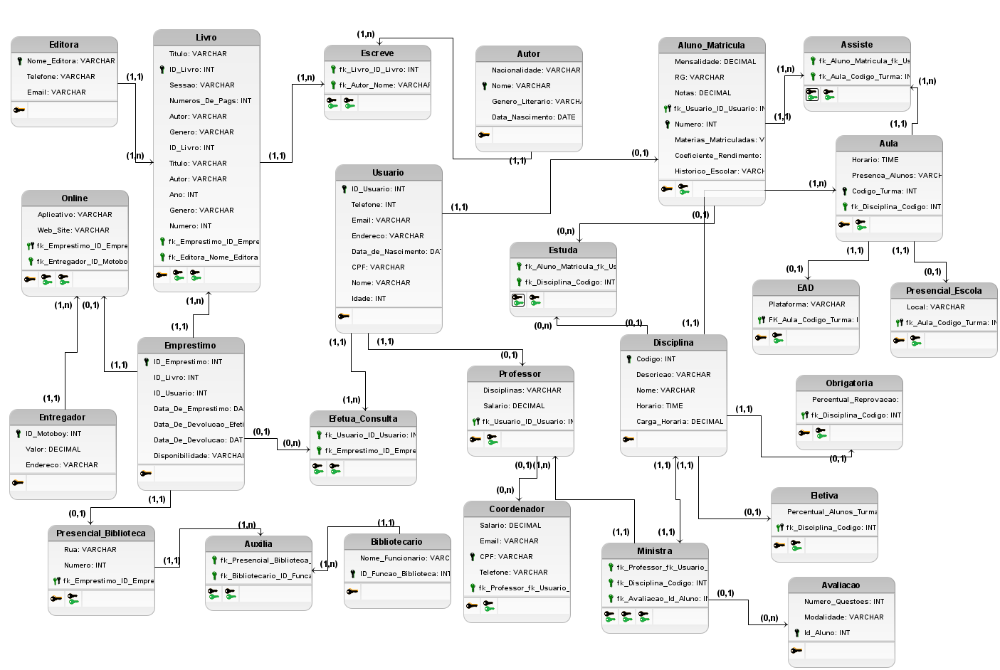

# EducaLivros Online

## Grupo

|                       |                        |
|:---------------------:|:----------------------:|
| Eduarda Barros        |     Gustavo Lima       |
|    *RA: 00000844550*  |   *RA: 00000844518*    |
|                       |                        |
|   Marcelo Petroni     |      Matheus Silva     |
|    *RA: 00000032651*  |    *RA: 00000007395*   |

## Descrição do Sistema
O banco de dados apresentado é uma estrutura complexa que abrange várias entidades e seus relacionamentos. Ele representa uma escola-livraria, fornecendo suporte para gerenciamento de livros, autores, usuários, empréstimos, entre outros. As tabelas incluem informações detalhadas, como gênero e título do livro, dados dos autores, informações de usuários, registros de empréstimos, além de aspectos relacionados à gestão escolar, como disciplinas, aulas e desempenho dos alunos. Os relacionamentos são estabelecidos por chaves estrangeiras, garantindo integridade referencial entre as tabelas e permitindo operações de consulta e manipulação eficazes.

Este banco de dados oferece um arcabouço abrangente para o gerenciamento eficiente de uma biblioteca e atividades educacionais, desde o cadastro de materiais até o controle de empréstimos e avaliações acadêmicas. Os dados são estruturados de forma a refletir as interações entre os diversos componentes do sistema, facilitando a busca e recuperação de informações relevantes. As restrições de chave estrangeira garantem a consistência dos dados e ajudam a manter a integridade do banco de dados, enquanto as operações de exclusão são cuidadosamente configuradas para preservar a coesão do sistema.

## Modelo Lógico

## Requisitos Implementados

- **Entidades Principais E Seus Atributos**: 
  - *Editora*: Nome_Editora, Telefone, Email
  - *Livro*: ID_Livro, Sessao, Numero_De_Pags, Titulo, Genero, Autor
  - *Emprestimo*: ID_Emprestimo, ID_Livro, ID_Usuario, Disponibilidade, Data_de_devolucao, Data_de_emprestimo, Data_de_devolucao_efetiva
  - *Online*: Aplicativo, Web_site
  - *Presencial_Biblioteca*: Endereço
  - *Entregador*: ID_Motoboy, Frete
  - *Balcao_Biblioteca*: ID_Funcao_Biblioteca, Nome_Funcionario
  - *Usuario*: ID_Usuario, CPF, Data_de_nascimento, Endereço, Email, Telefone, Nome, Idade
  - *Aluno*: RG, Notas, Mensalidade
  - *Professor*: Ident, Diciplinas, Salario
  - *Avaliacao*: Numero_questao, Modalidade, ID_Aluno
  - *Coordenador*: CPF, Email, Salario, Telefone
  - *Autor*: Nome, Genero_Literario, Data_de_nascimento, Nacionalidade
  - *Matricula*: Numero, Historico_escolar, Materias_matriculadas, Coeficiente_rendimento
  - *Disciplina*: Horario, Nome, Descricao, Carga_horaria, Codigo
  - *Obrigatoria*: Percentual_reprovacao, 
  - *Eletiva*: Percentual_alunos_turma
  - *Aula*: Codigo_turma, Presenca_aluno, Horario
  - *EAD*: Plataforma
  - *Presencial_Escola*: Local

## Data Manipulation Language (DML)

----- INSERT ----

INSERT INTO Editora (Nome_Editora, Telefone, Email) 
VALUES 
('Companhia das Letras', '+55 11 9999-9999', 'contato@companhiadasletras.com.br'),
('Penguin Random House', '+1 212-782-9000', 'info@penguinrandomhouse.com'),
('HarperCollins', '+1 212-207-7000', 'webmaster@harpercollins.com');

INSERT INTO Usuario (ID_Usuario, Telefone, Email, Endereco, Data_de_Nascimento, CPF, Nome, Idade) 
VALUES 
(1, '+55 11 1234-5678', 'fulano@gmail.com', 'Rua A, 123', '1990-01-15', '123.456.789-00', 'Fulano de Tal', 34),
(2, '+55 11 9876-5432', 'beltrano@gmail.com', 'Rua B, 456', '1985-05-20', '987.654.321-00', 'Beltrano da Silva', 39),
(3, '+55 11 1111-2222', 'ciclano@gmail.com', 'Rua C, 789', '2000-12-10', '111.222.333-00', 'Ciclano Pereira', 24);

INSERT INTO Livro (Titulo, ID_Livro, Sessao, Numeros_De_Pags, Autor, Ano, Genero, Numero, fk_Emprestimo_ID_Emprestimo, fk_Editora_Nome_Editora) 
VALUES 
('Dom Casmurro', 1, 'Ficção', 256, 'Machado de Assis', 1899, 'Romance', 101, NULL, 'Companhia das Letras'),
('Os Miseráveis', 2, 'Ficção', 1488, 'Victor Hugo', 1862, 'Romance', 102, NULL, 'Penguin Random House'),
('1984', 3, 'Ficção', 328, 'George Orwell', 1949, 'Ficção Científica', 103, NULL, 'HarperCollins');

INSERT INTO Emprestimo (ID_Emprestimo, ID_Livro, ID_Usuario, Data_De_Emprestimo, Data_De_Devolucao_Efetiva, Data_De_Devolucao, Disponibilidade) 
VALUES 
(101, 1, 1, '2024-04-20', '2024-05-10', NULL, 'Disponível'),
(102, 2, 2, '2024-04-15', NULL, NULL, 'Indisponível'),
(103, 3, 3, '2024-04-10', NULL, NULL, 'Indisponível');

Podemos arrumar esses valores de emprestimo (NULL)

----- DELETE ----

DELETE FROM Usuario WHERE ID_Usuario = 3;

DELETE FROM Livro WHERE ID_Livro = 2;

DELETE FROM Bibliotecario WHERE ID_Funcao_Biblioteca = 1;  

DELETE FROM Bibliotecario WHERE Nome_Funcionario = 'João Silva';

--- UPDATE ---

UPDATE Editora SET Telefone = '+55 11 9876-5432' WHERE Nome_Editora = 'Companhia das Letras';

UPDATE Editora SET Email = 'info@harpercollins.com' WHERE Nome_Editora = 'HarperCollins';

UPDATE Usuario SET Telefone = '+55 11 1111-2222', Email = 'novobeltrano@gmail.com' WHERE ID_Usuario = 2;

UPDATE Emprestimo SET Data_De_Emprestimo = '2024-04-24' WHERE ID_Livro = 2;

UPDATE Emprestimo SET   Data_De_Devolucao = '2024-05-24' WHERE ID_Livro = 2;

UPDATE Emprestimo SET  Data_De_Devolucao_Efetiva = '2024-06-24' WHERE ID_Livro = 2;

## Tomada de Decisão

Obs: Primeiro faça a inserção dos dados no banco de dados. 
     Colocamos um arquivo txt (insert-update-delete.txt) com todas as inserções necessárias para realizar os testes.

1 - Qual gêneros mais alugado entre os alunos da escola?

Código para consultar no banco de dados:

SELECT Livro.Genero, COUNT() AS Quantidade_Alugada
FROM Emprestimo
JOIN Livro ON Emprestimo.ID_Livro = Livro.ID_Livro
-- Se necessário, você pode adicionar a tabela Usuario para filtrar empréstimos de alunos específicos
-- JOIN Usuario ON Emprestimo.ID_Usuario = Usuario.ID_Usuario
GROUP BY Livro.Genero
ORDER BY Quantidade_Alugada DESC
LIMIT 1

2 - Qual a quantidade de devolução de livros dentro do prazo de vencimento?

SELECT COUNT() AS Devolucoes_Dentro_Do_Prazo
FROM Emprestimo
WHERE Data_De_Devolucao_Efetiva <= Data_De_Devolucao; -- Considerando que a data de devolução efetiva é menor ou igual à data de devolução esperada

3 - Qual é o média percentual de reprovação para os alunos que estudam disciplinas obrigatorias? 
SELECT AVG(percentual_reprovacao)
from obrigatoria;

4 - Como está a disponibilidade dos livros nos diferentes canais de distribuição, presencial e online? Isso pode ajudar a garantir que os clientes tenham acesso fácil aos livros que desejam, independentemente de onde estejam.

SELECT
    Livro.Titulo AS Titulo_Livro,
    COUNT(Presencial_Biblioteca.fk_Emprestimo_ID_Emprestimo) AS Quantidade_Presencial,
    COUNT(Online.fk_Emprestimo_ID_Emprestimo) AS Quantidade_Online
FROM
    Livro
LEFT JOIN
    Presencial_Biblioteca ON Livro.ID_Livro = Presencial_Biblioteca.fk_Emprestimo_ID_Emprestimo
LEFT JOIN
    Online ON Livro.ID_Livro = Online.fk_Emprestimo_ID_Emprestimo
GROUP BY
    Livro.Titulo;

5- Qual o percentual de presença nos alunos nas aulas?
SELECT 
    Aula.Codigo_Turma AS Codigo_Turma,
    COUNT(CASE WHEN Aula.Presenca_Alunos = 'Presente' THEN 1 END) AS Alunos_Presentes,
    COUNT(CASE WHEN Aula.Presenca_Alunos = 'Ausente' THEN 1 END) AS Alunos_Ausentes,
    COUNT() AS Total_Alunos,
    (COUNT(CASE WHEN Aula.Presenca_Alunos = 'Presente' THEN 1 END) 100.0 / COUNT(*)) AS Percentual_Presenca
FROM 
    Aula
GROUP BY 
    Aula.Codigo_Turma;

## Easter Egg

(FAlta dizer o que Easter egg faz) especificar o que foi utilizado a mais: function para criar o easter egg

Easter Egg: Aluno com o maior coeficiente de rendimento ganha 100% de desconto na matricula. 

-- Identifique o aluno com o maior coeficiente de rendimento
SELECT * FROM Aluno_Matricula WHERE Coeficiente_Rendimento = (SELECT MAX(Coeficiente_Rendimento) FROM Aluno_Matricula);

-- Atualize os dados do aluno com o maior coeficiente de rendimento

SELECT apply_discount();

-- Verifique se a mensalidade foi atualizada para 0

SELECT * FROM Aluno_Matricula;

