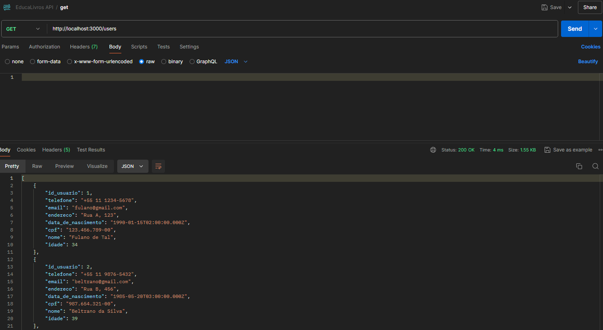
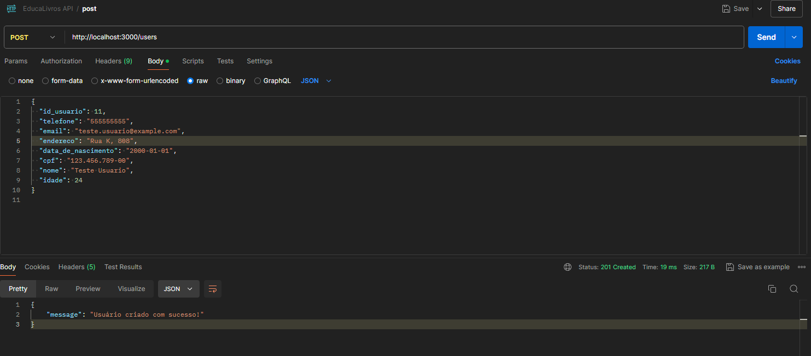
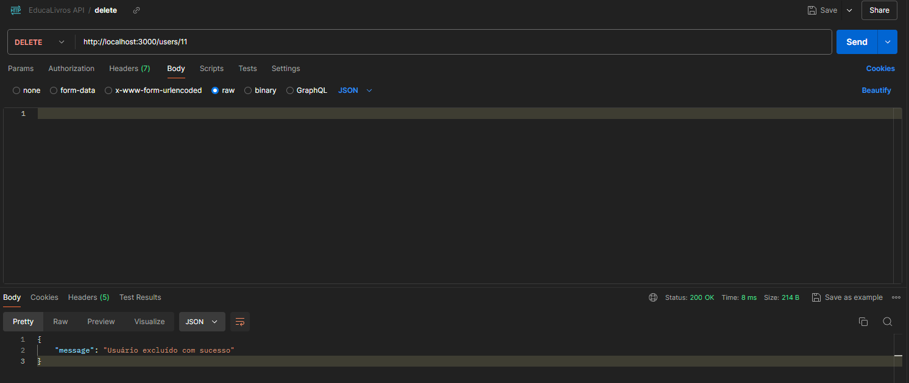
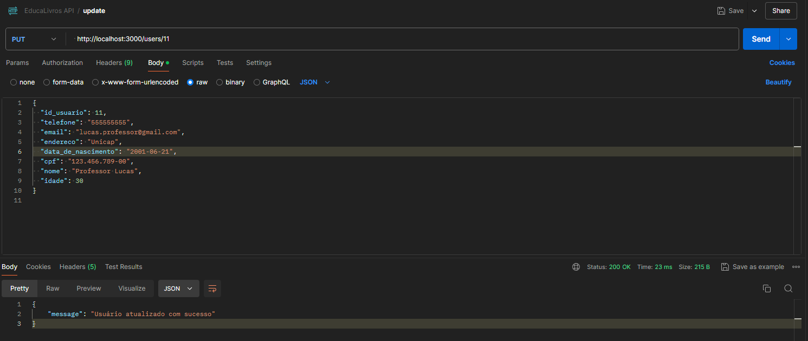

# Tutorial para executar e testar nosso Banco com KoaJS e NodeJS.

## Requisitos
- Node.js
- Koa.js
- Postman
- PostgreSQL

## Passo 1: Instalação do KoaJS e Dependências do NodeJS

Primeiro, precisamos instalar as dependências necessárias.

*Descrição das Dependências*

- koa: Framework web minimalista para Node.js.
- koa-router: Middleware de roteamento para KoaJS.
- knex: Query builder para SQL.
- pg: Cliente PostgreSQL para Node.js.

#### 1 - NodeJS

O Node.js é necessário para rodar o Koa.js. Aqui estão os passos para instalar o Node.js:

- Acesse o site oficial do Node.js: https://nodejs.org/en/download/package-manager
- Clique no botão "LTS" para baixar a versão estável.
- Após o download, execute o instalador.

#### 2 - KoaJS

```bash
npm install koa koa-router knex pg
```

## Passo 2: Criar o Arquivo knexfile.js

Este arquivo configurará a conexão com o banco de dados PostgreSQL.

Crie um arquivo chamado knexfile.js e adicione o seguinte código:

knexfile.js
```js
module.exports = {
  development: {
    client: 'pg',
    connection: {
      host: 'localhost',
      user: 'your_db_user', // seu usuario. (postgres)
      password: 'your_db_password', // sua senha ()
      database: 'your_database_name' // Nome do seu banco
    },
    migrations: {
      tableName: 'knex_migrations'
    }
  }
};
```
Certifique-se de substituir your_db_user, your_db_password, e your_database_name pelas suas credenciais de banco de dados.

Temos alguns pontos importantes para pontuar:

- Em alguns casos o seu *USER* pode vir padrão no postgre, então coloque o "postgres" que irá funcionar corretamente.
- Atenção com o nome do seu Data Base, coloque exatamente igual ao que está no PostgreSQl(pgAdmin4). Se você colocar diferente, ele nunca vai se conectar com o seu banco de dados.
- Não tenho 100% de certeza, mas a sua senha é aquela que você coloca no ato da instalação do postgre. Se você não sabe a senha... boa sorte, eu não sei como te ajudar com isso 😭. Digamos que é um pouco complicado mudar a senha, mas enfim vamos seguir.

## Passo 3: Criar o Arquivo para Conexão do Banco db.js

Crie um arquivo chamado db.js e adicione o seguinte código:

db.js
```js
const knex = require('knex');  // importando modulo knex
const knexConfig = require('./knexfile'); // importando a configuração do KnexFile.js

const db = knex(knexConfig.development); // criação da Instância do Knex

module.exports = db; // Exportação da Instância do Knex
```
O Knex.js é um construtor de consultas SQL (query builder) para Node.js, que suporta múltiplos bancos de dados, incluindo o PostgreSQL.Ele facilita a escrita de consultas SQL e proporciona migrações de banco de dados, transações e manipulação de esquemas.

- Importação do Knex: Traz a biblioteca Knex para nosso projeto.
- Importação da Configuração do Knex: Importa as configurações do banco de dados a partir do knexfile.js.
- Criação da Instância do Knex: Cria uma instância configurada do Knex que está pronta para interagir com o banco de dados.
- Exportação da Instância do Knex: Torna a instância do Knex disponível para outras partes do código.


## Passo 4: Criar o Arquivo index.js com o Server e as Rotas

Crie um arquivo chamado index.js e adicione o seguinte código:

```js
const Koa = require('koa'); // importando o Koa
const Router = require('koa-router'); // importando a Rota do Koa
const bodyParser = require('koa-bodyparser'); // converte requisicoes http para Json

const userRoutes = require('./routes/userRoutes'); // rota para usuario
const bookRoutes = require('./routes/bookRoutes'); // rota para livro
const loanRoutes = require('./routes/loanRoutes'); // rota para emprestimo

const app = new Koa();
const router = new Router();

app.use(bodyParser());

router.use('/users', userRoutes.routes());
router.use('/books', bookRoutes.routes());
router.use('/loans', loanRoutes.routes());

app.use(router.routes()).use(router.allowedMethods());

const PORT = process.env.PORT || 3000;
app.listen(PORT, () => {
  console.log(`Server is running on port ${PORT}`);
});
```

## Passo 5: Criar o Arquivo userRoutes.js

Agora vamos criar o arquivos com os métodos do crud:

```js
const Router = require('koa-router');
const db = require('../db');

const router = new Router();

router.get('/users', async (ctx) => {
  const users = await db('Usuario').select('*');
  ctx.body = users;
});


router.post('/', async (ctx) => {
  const { id_usuario, telefone, email, endereco, data_de_nascimento, cpf, nome, idade } = ctx.request.body;
  try {
    await db('usuario').insert({ id_usuario, telefone, email, endereco, data_de_nascimento, cpf, nome, idade });
    ctx.status = 201;
    ctx.body = { message: 'Usuário criado com sucesso!' };
  } catch (err) {
    ctx.status = 500;
    ctx.body = { message: err.message };
  }
});


router.get('/', async (ctx) => {
  try {
    const users = await db('usuario').select('*');
    ctx.body = users;
  } catch (err) {
    ctx.status = 500;
    ctx.body = { message: err.message };
  }
});


router.get('/:id', async (ctx) => {
  const { id } = ctx.params;
  try {
    const user = await db('usuario').where({ id_usuario: id }).first();
    if (user) {
      ctx.body = user;
    } else {
      ctx.status = 404;
      ctx.body = { message: 'Usuário não encontrado' };
    }
  } catch (err) {
    ctx.status = 500;
    ctx.body = { message: err.message };
  }
});

router.put('/:id', async (ctx) => {
  const { id } = ctx.params;
  const { telefone, email, endereco, data_de_nascimento, cpf, nome, idade } = ctx.request.body;
  try {
    const updated = await db('usuario').where({ id_usuario: id }).update({ telefone, email, endereco, data_de_nascimento, cpf, nome, idade });
    if (updated) {
      ctx.body = { message: 'Usuário atualizado com sucesso' };
    } else {
      ctx.status = 404;
      ctx.body = { message: 'Usuário não encontrado' };
    }
  } catch (err) {
    ctx.status = 500;
    ctx.body = { message: err.message };
  }
});

router.delete('/:id', async (ctx) => {
  const { id } = ctx.params;
  try {
    const deleted = await db('usuario').where({ id_usuario: id }).del();
    if (deleted) {
      ctx.body = { message: 'Usuário excluído com sucesso' };
    } else {
      ctx.status = 404;
      ctx.body = { message: 'Usuário não encontrado' };
    }
  } catch (err) {
    ctx.status = 500;
    ctx.body = { message: err.message };
  }
});

module.exports = router;

```

### Descrição das Rotas
- GET /users: Retorna todos os usuários.
- GET /users/id: Retorna um usuário específico pelo ID.
- POST /users: Cria um novo usuário.
- PUT /users/: Atualiza um usuário específico pelo ID.
- DELETE /users/: Deleta um usuário específico pelo ID.

## Passo 6: Executar o Servidor
No terminal, execute o seguinte comando para iniciar o servidor:

```bash
node index.js
```

## Passo 7: Usando o Postman para Testar as Rotas

### Testando a Rota GET

Abra o Postman:
- Selecione o método GET.
- Insira a URL: http://localhost:3000/users
- Clique em Send.




### Testando a Rota POST
- Selecione o método POST.
- Insira a URL: http://localhost:3000/users
- Vá para a aba Body.
- Selecione raw e JSON.
- Insira o seguinte JSON:

```json
{
  "id_usuario": 11,
  "telefone": "555555555",
  "email": "teste.usuario@example.com",
  "endereco": "Rua K, 808",
  "data_de_nascimento": "2000-01-01",
  "cpf": "123.456.789-00",
  "nome": "Teste Usuario"
}
```
- Clique em Send.




### Testando a Rota DELETE

- Selecione o método DELETE.
- Insira a URL: http://localhost:3000/users/11
- Clique em Send.



### Testando a Rota UPDATE

- Selecione o método PUT.
- Insira a URL: http://localhost:3000/users/11
- Selecione raw e JSON.
- Insira o seguinte JSON:
```json
{
  "id_usuario": 11,
  "telefone": "555555555",
  "email": "lucas.professor@gmail.com",
  "endereco": "Unicap",
  "data_de_nascimento": "2001-06-21",
  "cpf": "123.456.789-00",
  "nome": "Professor Lucas",
  "idade": 30
}

```
- Clique em Send.




